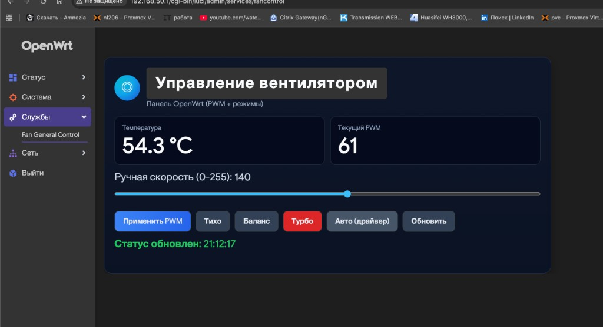

# OpenWrt Fan UI Backup

Резервный исходник рабочей панели управления вентилятором для OpenWrt/LuCI.

## Что сделано

- Кастомный UI в темной теме (`Fan General Control`) под путь `admin/services/fancontrol`
- Ручное управление PWM: `Применить PWM`, `Тихо`, `Баланс`, `Турбо`
- Автоматический режим драйвера: `Авто (драйвер)`
- Бэкенд-скрипт `fan-control-rpc` для чтения температуры/скорости и безопасного применения режимов
- ACL + menu override, чтобы был один стабильный пункт меню
- Скрипты установки, self-test и rollback

## Скриншот



## Состав проекта

- `htdocs/luci-static/resources/view/system/fan_control.js` - интерфейс LuCI
- `root/usr/bin/fan-control-rpc` - backend RPC helper
- `root/etc/config/fancontrol` - конфиг по умолчанию
- `root/usr/share/rpcd/acl.d/luci-app-fan-control.json` - права RPC
- `root/usr/share/luci/menu.d/zz-fancontrol-override.json` - override меню на `admin/services/fancontrol`
- `scripts/install-to-router.sh` - установка на роутер
- `scripts/selftest-router.sh` - проверка работоспособности
- `scripts/rollback-menu-duplicate.sh` - удаление дубликата пункта меню

## Установка на роутер

```bash
./scripts/install-to-router.sh 192.168.50.1
```

Открыть UI:

`http://192.168.50.1/cgi-bin/luci/admin/services/fancontrol`

## Проверка после установки

```bash
./scripts/selftest-router.sh 192.168.50.1
```

Ожидаемо:
- файлы на месте
- `status` возвращает JSON с `temp_c` и `current_pwm`
- команды `apply_auto`, `apply_manual`, `preset balanced` работают
- в конце `manual_mode=0` (возврат в авто-режим)

## Сборка бэкапа архивом

```bash
mkdir -p dist
tar -czf dist/luci-app-fan-control-backup.tar.gz Makefile htdocs root scripts docs README.md
```

## Публикация на GitHub (WaterFall11111)

1. Создать новый пустой репозиторий на GitHub, например: `openwrt-fan-ui-backup`
2. Выполнить:

```bash
git init
git add .
git commit -m "Backup: working OpenWrt fan UI with auto/manual control"
git branch -M main
git remote add origin https://github.com/WaterFall11111/openwrt-fan-ui-backup.git
git push -u origin main
```

